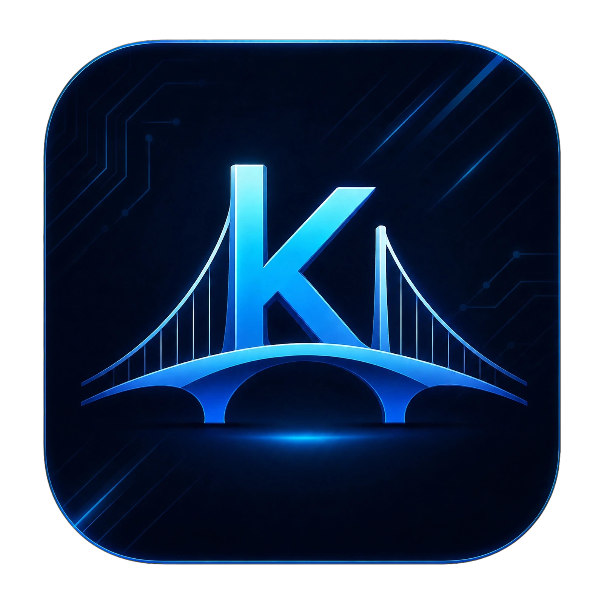
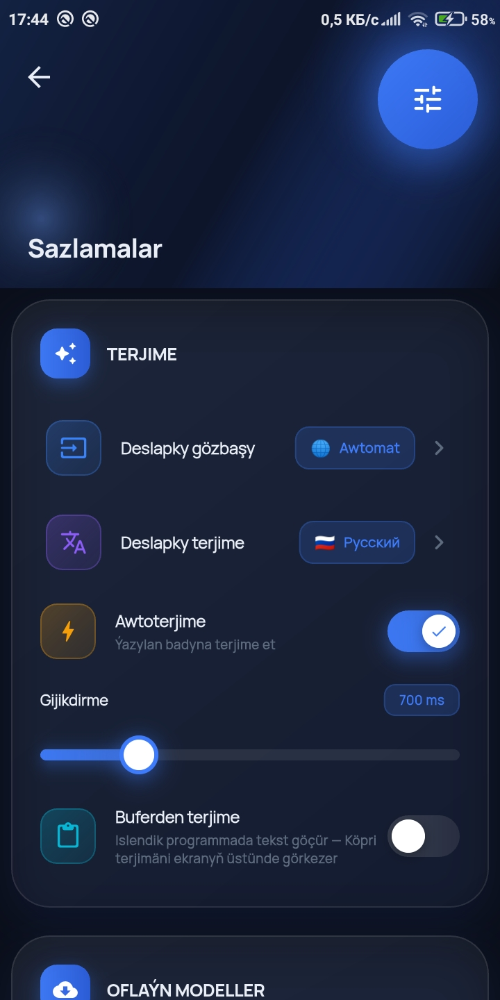
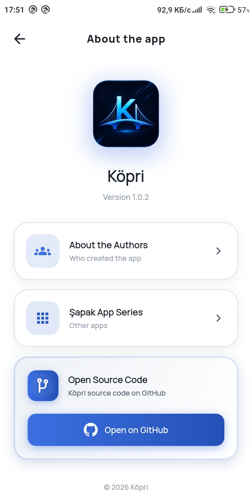
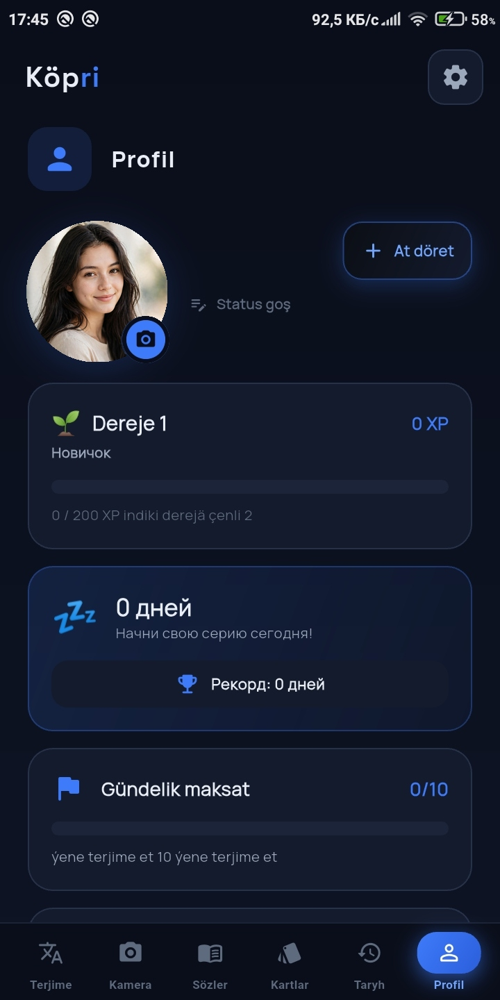
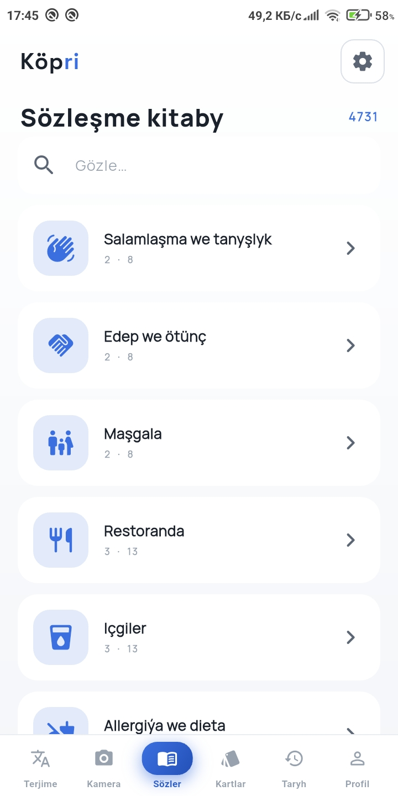
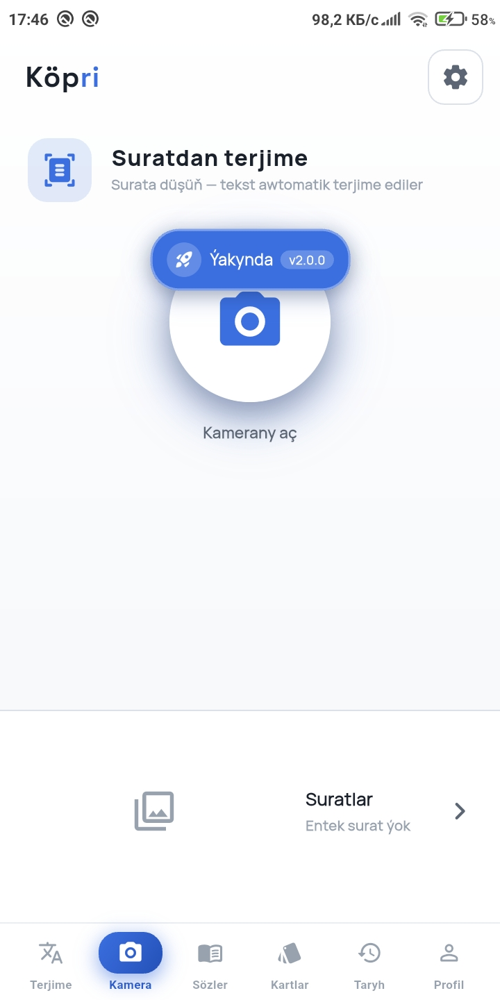
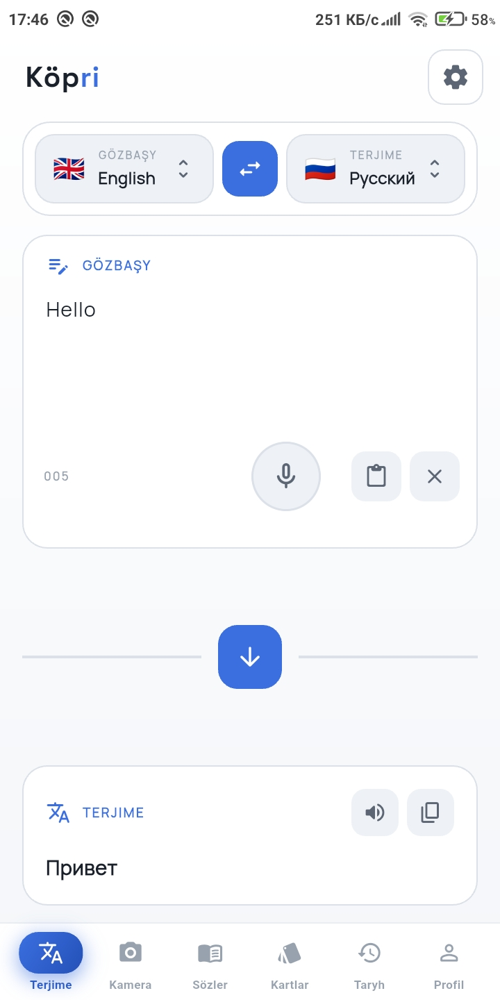

<div align="center">



# Köpri Translator

Kamera (gibrid OCR) bilen oflaýn terjimeçi, uly gepleşik kitaby we tekst-tekst terjime


[🇬🇧 English](./README.md) · [🇷🇺 По-русски](./README.ru.md)

</div>

---

**Köpri** — Flutter-da ýasalan mugt, oflaýn terjimeçi. Kameraňyzy islendik tekste gönükdiriň, tekst-tekst terjime ediň ýa-da uly gepleşik kitabyny açyň — hemmesi internetsiz işleýär.

## 📱 Ekran şekilleri

<div align="center">






</div>

## ✨ Mümkinçilikler

- 📸 **Kamera terjimesi (gibrid OCR)** — **Google ML Kit** arkaly örän çalt tekst tanamak (latyn elipbiýi, ~0.3 s) + **Tesseract OCR** (kiril, arap, CJK, dewanagari) ätiýaçlyk hökmünde
- 💬 **Tekst-tekst terjime** — 50+ diliň arasynda dessine terjime
- 📖 **Uly gepleşik kitaby** — onlarça kategoriýada müňlerçe fraza
- 📴 **Doly oflaýn** — internet gerek däl, maglumatlar enjamda galýar
- 🕘 **Taryh** — ähli terjimeler lokal ýatda saklanýar
- ⭐ **Halanlar** — ýygy ulanýan frazalaryňyzy saklaň
- 🎨 **Häzirki zaman UI** — garaňky režimli arassa dizaýn
- 👤 Profil — öz statistikaňyza, geçirilen işleriňize we ulanyş vedomostlaryňyza aňsatlyk bilen gözegçilik ediň
- 🚀 **Natiw tizlik** — agyr hasaplamalar (XP, strіkler, statistika, JSON parsіň, awatar resize) **C++17 FFI arkaly** işleýär — arassa Dart-dan 10–60 esse çalt

### 🌍 Goldanylýan diller

🇬🇧 Iňlis · 🇷🇺 Rus · 🇹🇲 Türkmen · 🇹🇷 Türk · 🇰🇿 Gazak · 🇹🇯 Täjik · 🇺🇿 Özbek · 🇺🇦 Ukrain · 🇨🇳 Hytaý · 🇯🇵 Ýapon · 🇰🇷 Koreý · 🇸🇦 Arap · 🇩🇪 Nemes · 🇫🇷 Fransuz · 🇪🇸 Ispan · 🇮🇹 Italýan · 🇮🇳 Hindi we başgalar

## 🛠 Tehnologiýalar

| Gat | Tehnologiýa                                                                                                      |
| --- |------------------------------------------------------------------------------------------------------------------|
| Freýmwork | [Flutter](https://flutter.dev) 3.x                                                                               |
| Dil | [Dart](https://dart.dev) 3.x                                                                                     |
| **Natiw ýadro** | **C++17 (FFI arkaly)** — XP, strіkler, statistika, JSON/CSV, awatar resize, terjime parsіň wede has köp ýadrolar |
| OCR (latyn) | [Google ML Kit](https://developers.google.com/ml-kit/vision/text-recognition) (oflaýn, enjamda)                  |
| OCR (kiril / arap / CJK / dewanagari) | [Tesseract OCR](https://tesseract-ocr.github.io) (flutter_tesseract_ocr)                                         |
| Kamera | [camera](https://pub.dev/packages/camera)                                                                        |
| Ammar | SharedPreferences / Hive                                                                                         |
| Arhitektura | Feature-first, arassa arhitektura                                                                                |

> **Näme üçin gibrid?** ML Kit latyn elipbiýinde Tesseract-den 10–20 esse çalt (ýazgylar, menýu, resminamalar), Tesseract bolsa ML Kit-iň heniz goldamaýan elipbiýlerini (kiril, arap, dewanagari) tanaýar.

### ⚡ C++ modullary (natiw tizlik)

| Modul              | Maksady                                                                                 |
|--------------------|-----------------------------------------------------------------------------------------|
| `xp_engine`        | XP, derejeler, öňegidişlik (Dart `math.pow` halkalaryndan 20 esse çalt)                 |
| `streak_engine`    | Häzirki/iň gowy strіk — Hinnant-yň raýat günleri algoritmi bilen (aý/ýyl boýunça takyk) |
| `stats_engine`     | Hepdelik grafik (O(n)), pik sagady, ortaça uzynlyk, iň köp frazalar — hemmesi C++-da    |
| `json_lite`        | Profil eksporty üçin öz ýazylan rekurssiý JSON parseri                                  |
| `csv_engine`       | Taryhy eksporty üçin natiw JSON→CSV konwersiýa                                          |
| `image_fast`       | `stb_image` arkaly dessine awatar resize (512px) — foto goýlanda UI doňmaýar            |
| `translate_engine` | Natiw elipbiý kesgitleme, Google GTX jogaby parsіň, uzyn tekstleri bölmek               |
| `ffi_bridge`       | Dart we natiw kitaphananyň arasynda FFI köprüsi                                         |
| `Wagt bilen`       | has köpeler                                                                             |

## 🚀 Başlamak

### Zerurlyklar

- [Flutter SDK](https://docs.flutter.dev/get-started/install) 3.0+
- [Dart SDK](https://dart.dev/get-dart) (Flutter bilen bile gelýär)
- [Android Studio](https://developer.android.com/studio) ýa-da [VS Code](https://code.visualstudio.com)
- [Git](https://git-scm.com)

Barlaň:

```bash
flutter doctor
```

### Gurnama

**1. Repozitoriýany klonlaň**

```bash
git clone https://github.com/aynazar-sylyyew-dev/K-pri-App-for-phone.git
cd K-pri-App-for-phone
```

**2. Baglylyklary gurnaň**

```bash
flutter pub get
```

**3. ⚠️ WAJYP: OCR modellerini `assets/tessdata/` papkasyna goýuň**

Latyn elipbiýini **Google ML Kit** tanaýar (model Google Play Services arkaly awtomatik göçürilýär), şonuň üçin Tesseract diňe **kiril, arap, CJK we dewanagari** modelleri gerek. `eng.traineddata` we `tur.traineddata` Google Play Services bolmadyk enjamlar üçin ätiýaçlyk hökmünde galdyrylan. Jemi **38 model faýly** gerek.

Ähli modelleri bir buýruk bilen göçürip alyň:

```powershell
# PowerShell (Windows) — proýekt kökünde işlediň
New-Item -ItemType Directory -Force -Path "assets\tessdata" | Out-Null
"eng tur rus ukr bel bul srp mkd kaz uzb_cyrl kir tgk mon ara fas urd heb pus chi_sim chi_tra jpn kor hin tha tam tel ben nep pan guj mar kan mal sin khm lao mya".Split(" ") | ForEach-Object {
    Invoke-WebRequest -Uri "https://github.com/tesseract-ocr/tessdata_fast/raw/main/$_.traineddata" -OutFile "assets\tessdata\$_.traineddata"
}
```

```bash
# curl (Linux / macOS) — proýekt kökünde işlediň
mkdir -p assets/tessdata
for c in eng tur rus ukr bel bul srp mkd kaz uzb_cyrl kir tgk mon ara fas urd heb pus chi_sim chi_tra jpn kor hin tha tam tel ben nep pan guj mar kan mal sin khm lao mya; do
  curl -L "https://github.com/tesseract-ocr/tessdata_fast/raw/main/$c.traineddata" -o "assets/tessdata/$c.traineddata"
done
```

> Iň gowy hil üçin (uly faýllar) salgylarda `tessdata_fast` ýerine `tessdata` ulanyň.

**4. ⚠️ WAJYP: natiw awatar resize üçin stb_image headerlerini göçürip alyň**

`image_fast` C++ moduly dessine awatar resize etmek üçin [stb_image](https://github.com/nothings/stb) we [stb_image_write](https://github.com/nothings/stb) single-header kitaphanalaryny ulanýar. Olary `android/app/src/main/cpp/` papkasyna göçürip alyň:

```powershell
# PowerShell (Windows) — proýekt kökünde işlediň
New-Item -ItemType Directory -Force -Path "android\app\src\main\cpp" | Out-Null
Invoke-WebRequest -Uri "https://raw.githubusercontent.com/nothings/stb/master/stb_image.h" -OutFile "android\app\src\main\cpp\stb_image.h"
Invoke-WebRequest -Uri "https://raw.githubusercontent.com/nothings/stb/master/stb_image_write.h" -OutFile "android\app\src\main\cpp\stb_image_write.h"
```

```bash
# curl (Linux / macOS) — proýekt kökünde işlediň
mkdir -p android/app/src/main/cpp
curl -L "https://raw.githubusercontent.com/nothings/stb/master/stb_image.h" -o "android/app/src/main/cpp/stb_image.h"
curl -L "https://raw.githubusercontent.com/nothings/stb/master/stb_image_write.h" -o "android/app/src/main/cpp/stb_image_write.h"
```

> Eger stb headerleri ýok bolsa, programma awtomatik Dart nusgasyndan peýdalanar — hemme zat işlär, diňe biraz haýalrak.

**5. Android sazlamasy**

Programma **Android 5.0+ (API 21)** talap edýär. ML Kit modeliniň gurnalanda öňünden göçürilmegi üçin `android/app/src/main/AndroidManifest.xml` faýlynda `<application>` içine goşuň:

```xml
<meta-data
    android:name="com.google.mlkit.vision.DEPENDENCIES"
    android:value="ocr" />
```

`pubspec.yaml` faýlynda bardygyny barlaň:

```yaml
flutter:
  assets:
    - assets/tessdata/
    - assets/icon/
```

Programmany işletmekden öň build.gradle(andorid) we build.gradle(:app) oka

## 🏃 Işletmek (Debug)

```bash
flutter run
```

- `flutter devices` — elýeterli enjamlaryň sanawy
- Terminalda `r` — hot reload, `R` — hot restart

## 📦 Ýygnamak (Release)

**APK:**

```bash
flutter build apk --release
```

Taýýar faýl: `build/app/outputs/flutter-apk/app-release.apk`

**Arhitektura boýunça APK (kiçi göwrüm):**

```bash
flutter build apk --release --split-per-abi
```

**Google Play üçin App Bundle:**

```bash
flutter build appbundle --release
```

## 🔧 Meseleler

- **«tessdata not found»** — `.traineddata` faýllarynyň `assets/tessdata/` papkasyndadygyny barlaň, soň `flutter pub get` işlediň.
- **Ilkinji OCR işledilişi haýal** — Google Play Services ML Kit modelini bir gezek göçürýär (~5 MB), soňra tanamak ~0.3 s alýar.
- **Kamera işlemese** — ilkinji açylyşda Android kameradan peýdalanmaga rugsat sorar, rugsat beriň.
- **Klon soňy ýygnama ýalňyşlary** — `flutter clean && flutter pub get` işlediň.
- **C++ faýllar IDE-de gyzyl** — Android Studio-da `File → Sync Project with Gradle Files` açyň, NDK/CMake toolchain include ýollary çeksin.

## 🤝 Goşant

Goşantlar hoş garşylanýar! Issue açyň ýa-da pull request iberiň.

## 📄 Litsenziýa

Bu proýekt [Apache License 2.0](./LICENSE) esasynda paýlanýar.

## 👤 Awtor

**Aýnazar Sylyýew**
🐙 GitHub: [@aynazar-sylyyew-dev](https://github.com/aynazar-sylyyew-dev)

## 🙏 Minnetdarlyk

- [Flutter](https://flutter.dev) — kross-platforma freýmwork
- [Google ML Kit](https://developers.google.com/ml-kit) — enjamda tekst tanamak
- [Tesseract OCR](https://tesseract-ocr.github.io) — tekst tanamak hereketlendirijisi
- [Sean Barrett-iň stb kitaphanasy](https://github.com/nothings/stb) — natiw awatar resize üçin single-header kitaphana
- [flutter_tesseract_ocr](https://pub.dev/packages/flutter_tesseract_ocr) — OCR plagini

<div align="center">

❤️, Flutter we C++ bilen ýasaldy

[⭐ GitHub-da ýyldyz goýuň](https://github.com/aynazar-sylyyew-dev/K-pri-App-for-phone)

</div>